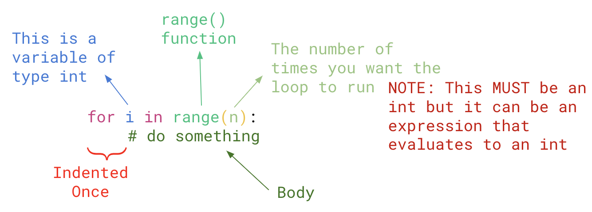
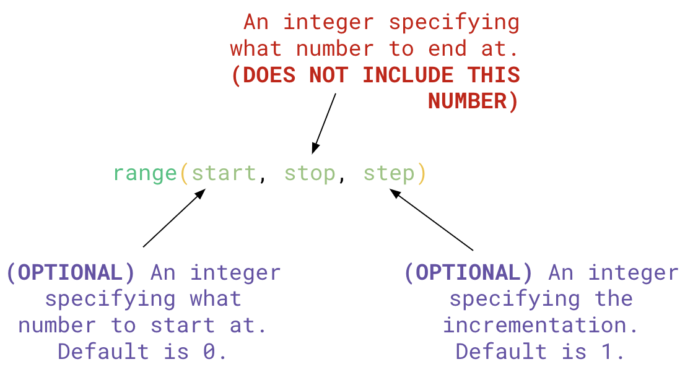

# 5.5 For Loops

So far, we've been able to control the flow of our programs by making decisions using `if` statements. However, what if we wanted to repeat something multiple times? We can use a **LOOPS**. There are two types of loops:
1. `for` loop 
2. `while` loop

In this lesson, we'll take a look at `for` loops: what they are and how to use them.

A **`for` loop** is a programming construct that allows you to execute code a predetermined number of times. It is considered a <ins>**COUNTED LOOP**</ins> because it runs a specific number of times. Each run is called an <ins>**ITERATION**</ins>.

## General Structure


| Part | Description                              |
| ---- | ---------------------------------------- |
| `i`  | This is a variable with type `int`. `i` is a common name used but you can call this variable whatever you want (of course still following the variable naming rules and conventions)      |
|      | It takes on a different value every time the loop runs starting at 0 and up to but not including n |
| `range()` | This is a function used to determine what is assigned to `i` each time the body of the for loop runs. |

## `range()` function
The `range()` function is very similar to the `.randrange()` function we looked at random numbers in Lesson 4.4



<span style="color: red">
<b>NOTE:</b> As stated in the preivous image, an expressions can go inside the <code>range()</code> function, as long as it evalutes to an <code>int</code>. (e.g. <code>range((10 * 2 - 5))</code> would be the same as <code>range(15)</code>
</span>

## Example #1: Single Number Range - Printing `i`
This example demonstrates what is stored in the variable `i` through each iteration of the loop
```python
for i in range(5):
  print(i)
```
><ins>**Output**</ins>:
```
0
1
2
3
4
```

## Example #2: Speific Range - Printing `i`
This example demonstrates what is stored in the variable `i` with a specified range.
```python
for i in range(10, 16):
  print(i)
```
><ins>**Output**</ins>:
```
10
11
12
13
14
15
```

## Example #3: Speific Range with Step Size - Printing `i`
This example demonstrates what is stored in the variable `i` with a specified range and step size.
```python
for i in range(10, 20, 2):
  print(i)
```
><ins>**Output**</ins>:
```
10
12
14
16
18
```

## Example #4: Using a Variable in `range()` - Printing `i`
This example demonstrates what is stored in the variable `i` when using an expression in the `range()` function
```python
n = 5

for i in range(n, n * 2):
  print(i)
```
><ins>**Output**</ins>:
```
5
6
7
8
9
```

## Example #5: Calculating Average - A Useful Example
Let's say we wanted to create a program that calculates the average of all the marks in our class. Before, we would store each mark in a different variable (e.g. `mark1`, `mark2`, `mark3`, etc.), then another variable `sum` that adds up all the marks. However, we have 20+ students in our class. It wouldn't make sense to have 20 variables for each mark.

Instead, we can use a `for` loop to help us keep a <ins>**running tally**</ins> of something. The general structure looks something like:
```python
sum = 0

for i in range(...):
  sum = sum + ...
```

The `sum` variable is called an <ins>**ACCUMULATOR VARIABLE**</ins>. Name it appropriately according to the problem.

```python

```